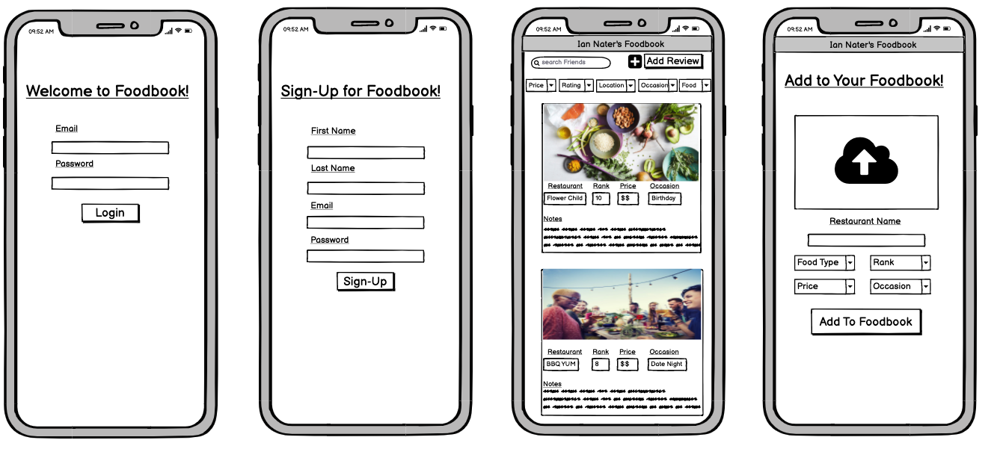

# Project-Two
This is our second group project for our class. We are making an app that will allow people to personally review restaurants they go to so that they can reference them in the future. 

## User Story
As a food lover, I want to be able to rank and comment on places I eat, so that I and my friends can easily reference them when deciding where to eat in the future. 

### App Flow
1. User will log into the app with their username and password.
2. If they have already created entries they will see them displayed and have the ability to sort based on ranking and other variables.
3. They will then be able to create a new entry for a restaurant. In the entry they will be able to add the restaurant name, their personal rating, waiter name, food they ate, occasion(birthday,anniversary, etc), and upload an image. 
4. When they save the entry it will get loaded into our database so that they can reference it later.

### Nice to Haves
1. Ability to book a reservation with open table.
2. Ability to comment on friends reviews.
3. Ability to see all of their restaurants on a map.

### Steps to completion 
1. Login/Signup page needs to work and add that info to the database
2. User lands on a review page where they can add their personal review (picture and above info)
3. User complete form and submits, that data is then stored in our db.
4. User can then click on a tab that takes them to a page that shows all current reviews
5. User can filter on the page to see all reviews or just theirs. They can also filter other things to narrow their preferences.

## Description: 
An app that can dynamically create a readme with proper markdown.
##Table of contents:
### 1.[Installation](#installation)
### 2.[Usage](#usage)
### 3.[Contributing](#contributing)
### 4.[Feedback](#feedback)
### 5.[License](#license)
### 6.[Github Username](#githubusername)
### 7.[Email link](#emaillink)
## Installation: 
**heroku link**
## Usage: 
This app allows users to sign up and sign into a webpage that sends them to a home page to view cards to restaurants that he/she have made. There is a create review button that sends them to a new page with places you can enter information about a restaurant you have been to and want to review! Price, occasion, rating, description, etc. After submitting this it takes you back to the homepage with your card with all the information you posted inside. There is also a search button that (if its in the database) you can search by name of people and view the cards they have made on restaurants as well so you can see what restaurants your friends have been to and see what their thoughts are on it! Lastly you can also filter out the cards you see by their rating, price, occasion, location and such to view specific needs you want for restaurants you are in the mood for!
## Contributing: 
Ian Nater, Kerem Karaman, and Zach Yanez
## Feedback: 
Obviously there are bugs! This is only our 2nd project and there are definitely some things that need to be added and fixed. Feel free to leave an email on fixes you see fit!
## License: 

## Github username: 
nathan-schmitzer
## For any questions send an email to: 
nathan.schmitzer@yahoo.com
